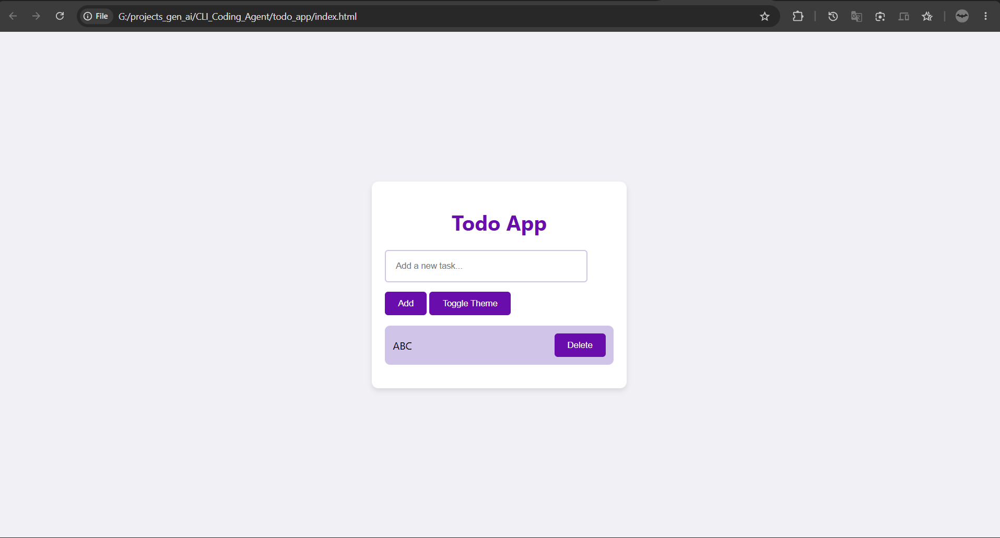

# 🤖 CLI Coding Agent

An AI-powered coding agent that takes natural language instructions and autonomously generates, writes, and executes code — including full frontend applications — directly from the command line.

Built using **OpenAI GPT-4o**, **Chain-of-Thought prompting**, and **real tool execution**, the agent reasons through tasks step-by-step before producing output.

---

## ✨ Demo — Todo App Generated by the Agent

The following Todo App (HTML + CSS + JS) was fully generated by giving the agent a single natural language instruction:

> *"Create a todo app with add and delete functionality and a dark/light theme toggle"*



---

## 🚀 Features

- **Chain-of-Thought Reasoning** — Agent plans step-by-step (START → PLAN → TOOL → OBSERVE → OUTPUT) before writing any code
- **File Writing** — Autonomously creates and saves code files to your system
- **Command Execution** — Runs shell commands to scaffold, build, or verify output
- **Live Tool Calling** — Integrates real tools (weather API, system commands, file I/O)
- **Structured Outputs** — Type-safe JSON at every step using Pydantic + OpenAI's `.parse()` API
- **Multi-turn Memory** — Maintains full conversation context across the session

---

## 🛠️ Tech Stack

`Python` · `OpenAI GPT-4o` · `Pydantic` · `Chain-of-Thought Prompting` · `Tool Calling` · `REST APIs`

---

## ⚙️ Setup

```bash
git clone https://github.com/akshatjain122004/CLI_Coding_Agent.git
cd CLI_Coding_Agent
pip install -r requirements.txt
cp .env.example .env
# Add your OpenAI API key to .env
python main.py
```

---

## 🧩 How It Works

```
User Prompt
    │
    ▼
START ──► PLAN (loop until ready)
               │
               ├──► TOOL CALL (if needed)
               │         │
               │    OBSERVE (tool output fed back)
               │
               ▼
            OUTPUT (final response / generated code)
```

Each step is a structured JSON object validated by Pydantic, ensuring the agent never skips reasoning or produces malformed output.

---

## 📁 Project Structure

| File | Purpose |
|------|---------|
| `main.py` | Core agent loop with CoT prompting and tool routing |
| `requirements.txt` | Python dependencies |
| `.env.example` | API key template (never commit `.env`) |
| `assets/` | Demo screenshots |

---

## 💡 Example Interaction

```
👉🏻 Create a todo app with a dark/light theme toggle

🧠 User wants a frontend todo application
🧠 Should include add/delete tasks and theme toggle
🧠 I'll write this as an HTML file with embedded CSS and JS
🛠️ run_command(mkdir todo_app)
🛠️ run_command(write index.html ...)
🤖 Done! Todo app created at todo_app/index.html
```

---

## 📜 License

MIT
